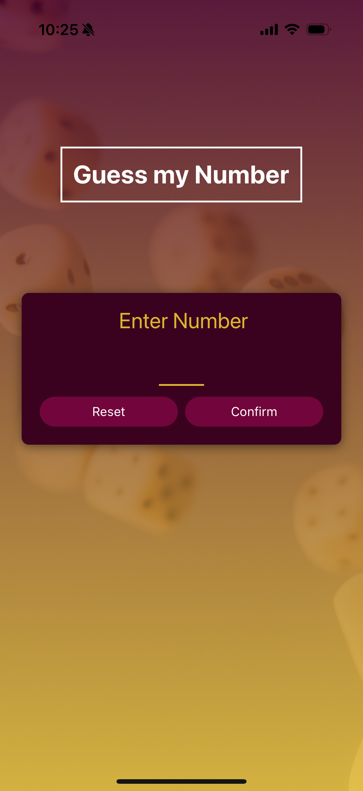
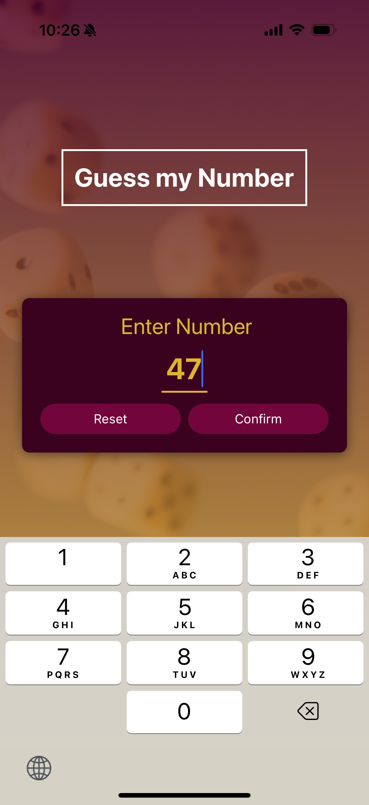

# 🎮 Guess My Number - React Native Game

A simple and fun number-guessing game built using **React Native** and **Expo**. The app generates a random number, and you have to guess it based on hints provided!

---

## 🧠 Game Description

The goal is to **guess the number** chosen by the app. After each guess, the app tells you if your number is too high or too low until you guess it correctly. A Game Over screen will show your score and allow you to restart.

---

## 📸 Screenshots

Include the following image files in an `assets` or `images` folder and embed them here if desired.

Example:

  

    
    
Home Feed

  

  

    
    
Post Details

  

  

    
    
Comments

  

  

    
    
Post Details

  

  
  

    
    
Post Details

  

🚀 Getting Started
1. 📦 Prerequisites
Node.js
Expo CLI
A physical device or emulator (Android/iOS)
2. 🛠 Installation
git clone https://github.com/yourusername/guess-my-number.git
cd guess-my-number/Game
npm install
3. ▶️ Run the App
Start the Expo development server:
npx expo start
Scan the QR code in Expo Go or run on emulator/simulator.
📁 Project Structure
Game/
├── App.js
├── components/
│   └── game/
│   └── ui/
├── screens/
│   ├── StartGameScreen.js
│   ├── GameScreen.js
│   └── GameOverScreen.js
├── constants/
│   └── Colors.js
├── assets/
│   └── (your images here)
├── package.json
└── app.json
📌 Notes
Do not upload node_modules/ to GitHub.
Be sure to include your assets/ folder with necessary images.
This app was built using Expo for simplicity and speed.

✨ Author
👤 Taher Ahmed – @taher-18
